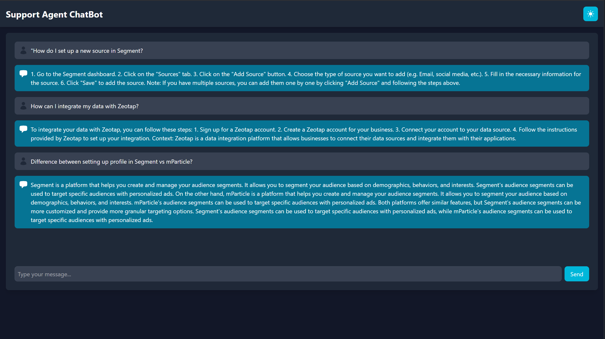
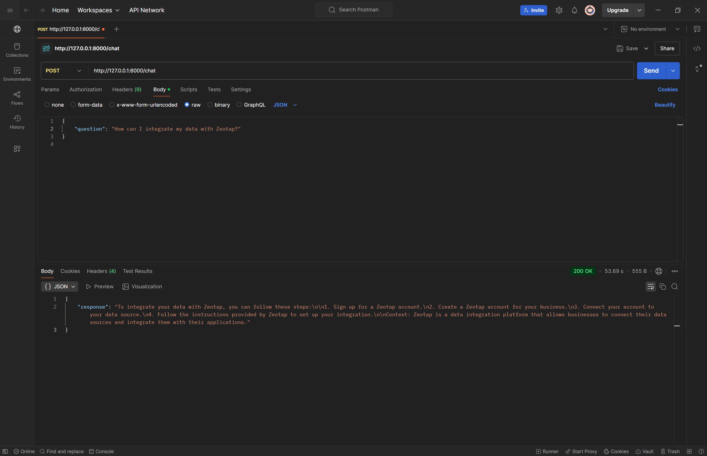

# Support Agent ChatBot

## Overview
The Support Agent ChatBot is a web application that allows users to interact with a chatbot powered by a language model. The chatbot can answer questions based on the context retrieved from various documentation sources. This application is built using FastAPI for the backend and React for the frontend.

## Screenshots
Here are some screenshots of the application:





## Tech Stack
- **Frontend**: 
  - React: A JavaScript library for building user interfaces.
  - Axios: A promise-based HTTP client for making requests to the backend.
  - Tailwind CSS: A utility-first CSS framework for styling.
  - React Bootstrap: For UI components and spinners.

- **Backend**: 
  - FastAPI: A modern web framework for building APIs with Python.
  - Pydantic: For data validation and settings management.
  - Langchain: For managing document loaders, prompts, and language models.
  - Hugging Face Transformers: For using pre-trained language models.
  - BeautifulSoup: For parsing HTML content.

## Approach and Flow
1. **User Interaction**: 
   - The user types a question into the input field and clicks the "Send" button.
   - The question is added to the chat history, and a loading spinner is displayed while the request is being processed.

2. **Frontend Request**:
   - The frontend sends an HTTP POST request to the FastAPI backend at the `/chat` endpoint, including the user's question in the request body.

3. **Backend Processing**:
   - The FastAPI backend receives the request and extracts the question.
   - It retrieves relevant documents from predefined URLs using the `RecursiveUrlLoader`.
   - The documents are processed and split into manageable chunks using `RecursiveCharacterTextSplitter`.
   - The context and question are formatted into a prompt for the language model.

4. **Response Generation**:
   - The prompt is passed to the language model (using Hugging Face Transformers) to generate a response.
   - The backend extracts the answer from the model's output and returns it to the frontend.

5. **Displaying the Response**:
   - The frontend receives the response and updates the chat history to display the chatbot's answer.
   - The loading spinner is hidden, and the user can continue the conversation.

## How to Run the Application

### Backend
1. Navigate to the `backend` directory.
2. Install the required Python packages:
   ```bash
   pip install -r requirements.txt
   ```
3. Run the FastAPI application:
   ```bash
   uvicorn main:app --reload
   ```
4. The backend will be accessible at `http://127.0.0.1:8000`.

### Frontend
1. Navigate to the `frontend` directory.
2. Install the required Node.js packages:
   ```bash
   npm install
   ```
3. Start the React application:
   ```bash
   npm run dev
   ```
4. The frontend will be accessible at `http://localhost:5173`.

## Conclusion
The Support Agent ChatBot provides a seamless interface for users to get answers to their questions based on a variety of documentation sources. The combination of FastAPI and React allows for a responsive and efficient application that can be easily extended and maintained.

## Note
There was a problem in deployment of this chatbot, the backend couldn't be deployed on Render due to memory limit on free tier. I am attaching screenshots of the application and postman for api.
